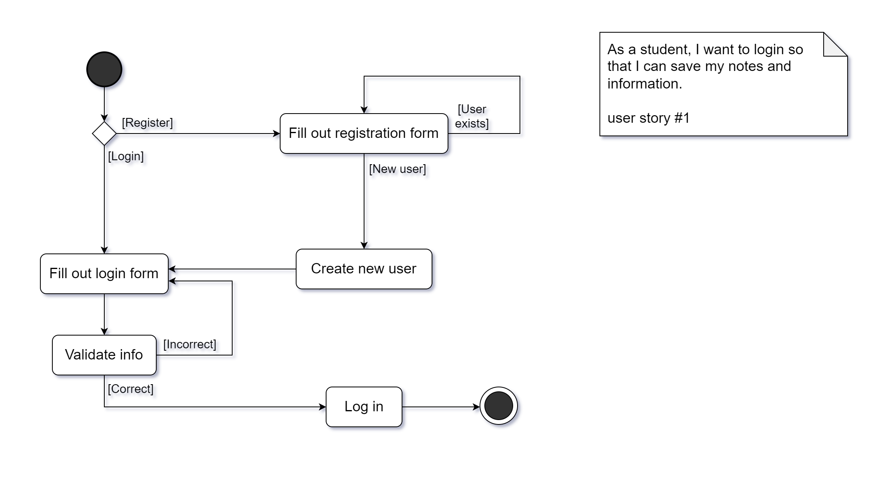
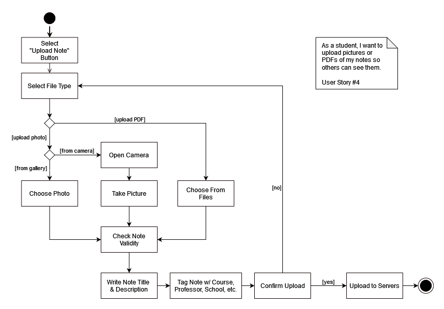

# Specifications

## Team members

[Richard Li](https://github.com/Silver1793) - rjl9943@nyu.edu  
[Allyson Chan](https://github.com/tinybitofheaven) - abc9295@nyu.edu  
[Brad Feng](https://github.com/BradFeng02) - bf2192@nyu.edu  
[Jeffrey Chen](https://github.com/FrozenEclipse) - jc9964@nyu.edu 

## Stakeholders

### Arnee Wen
An NYU student who used to take hand-written notes on paper but now takes notes on iPad.
#### Goals/Needs:
<ol>
<li>I want to be able to share my notes online in whatever format I want, pictures or PDF.</li>
<li>I want to be able to search for notes that other people have uploaded.</li>
<li>I want to be able to filter out notes based on the class, course or even the teacher the notes are associated with.</li>
<li>I want to know how reliable the notes I am getting are and how useful they are to other people.</li>
</ol>

#### Problems/Frustrations:
<ol>
<li>Quality of notes online is a big issue, I would like some way to tell if the notes are of good quality.</li>
<li>  Simply getting notes from people who’ve taken a class before isn’t enough to make the notes usable, I sometimes need more explanation.</li>
<li>Sometimes getting a peer’s notes for a class I missed is impossible because I don’t know anyone in large classes or the class is online and not recorded.</li>
<li>My notes can sometimes be misplaced since I write on paper so it would be nice if it was possible to have them be digitized.</li>
</ol>

## Product Vision Statement

A university-focused, social, note-sharing mobile application where students can upload, share and review each other’s notes by searching for notes using specific filters, such as professors, classes and subjects. 

## User Requirements

<ol>
<li>As a student, I want to login so that I can save my notes and information.</li>
<li>As a student, I want to logout so that I can protect my privacy.</li>
<li>As a student, I want to be able to see other people's notes so that I can see what other people's notes are.</li>
<li>As a student, I want to upload pictures or PDFs of my notes so others can see them.</li>
<li>As a student, I want to be able to see the profile of other users and all their notes, so that I can find more notes by the same user if I particularly like their notes.</li>
<li>As a student, I want to be able to delete my own notes because I don’t want them up anymore.</li>
<li>As an admin/moderator, I want to be able to delete user notes so that I can ensure the quality and validity of the notes uploaded.</li>
<li>As a student, I want to be able to search for notes based on fields such as Professor, Course, or Subject, so that I can find notes relevant to me and the courses I am taking.</li>
<li>As a professor, I want to upload pictures or PDFs of my notes so that official notes are available.</li>
<li>As a student, I want to be able to rate notes so that other users can see the quality of other notes.</li>
</ol>

## Activity Diagrams

As a student, I want to login so that I can save my notes and information.

As a student, I want to upload pictures or PDFs of my notes so others can see them.

## Clickable Prototype

### [Figma Prototype](https://www.figma.com/file/JtsXw8Li4wKDdu4XyEDMHI/swe-feeed?type=design&node-id=201%3A24&mode=design&t=nlrjeX9oegRKeVv7-1)

